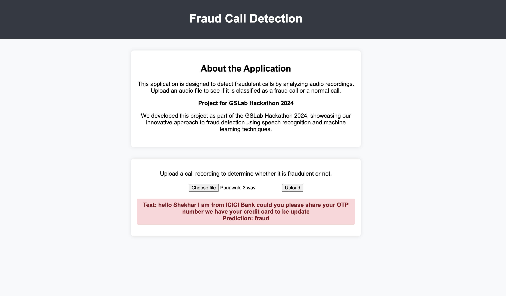

# Fraud Call Detection

This application is designed to detect fraudulent calls by analyzing audio recordings. Upload an audio file to see if it is classified as a fraud call or a normal call. This project was developed as part of the GSLab Hackathon 2024, showcasing our innovative approach to fraud detection using speech recognition and machine learning techniques.



## Table of Contents

- [Installation](#installation)
- [Usage](#usage)
- [Project Structure](#project-structure)
- [Technologies Used](#technologies-used)

## Installation

### Prerequisites

- Python 3.8 or higher
- Docker (optional, for containerized deployment)

### Steps

1. **Clone the repository:**
    ```bash
    git clone https://github.com/yourusername/fraud-call-detection.git
    cd fraud-call-detection
    ```

2. **Set up a virtual environment:**
    ```bash
    python -m venv venv
    source venv/bin/activate  # On Windows, use `venv\Scripts\activate`
    ```

3. **Install dependencies:**
    ```bash
    pip install -r requirements.txt
    ```

4. **Download NLTK data:**
    ```bash
    python -m nltk.downloader stopwords wordnet
    ```

### Using Docker

1. **Build the Docker image:**
    ```bash
    docker build -t fraud-call-detection .
    ```

2. **Run the Docker container:**
    ```bash
    docker run -p 5000:5000 fraud-call-detection
    ```

## Usage

1. **Start the Flask application:**
    ```bash
    flask run --host=0.0.0.0
    ```

2. **Open your web browser and navigate to:**
    ```
    http://localhost:5000
    ```

3. **Upload a call recording to determine whether it is fraud or not.**

## Technologies Used

- **Flask**: A micro web framework for Python.
- **SpeechRecognition**: Library for performing speech recognition.
- **NLTK**: Natural Language Toolkit for text processing.
- **pandas**: Data manipulation and analysis library.
- **scikit-learn**: Machine learning library.
- **Docker**: Containerization platform.
